# Chat Completions Data Flow

This document describes how HTTP requests and responses (headers and bodies) flow through the `ai_chat_completions` Caddy module.

## High-Level Architecture

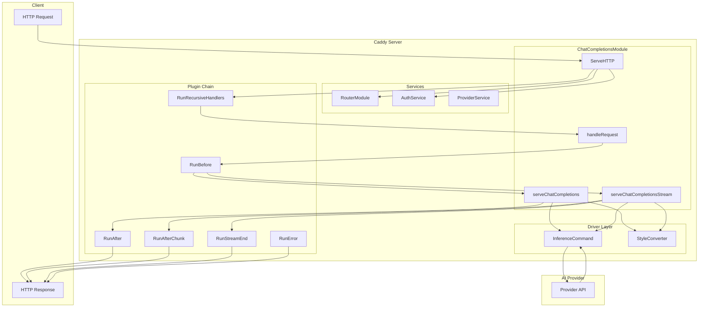

## Detailed Request Flow

### 1. Entry Point - ServeHTTP

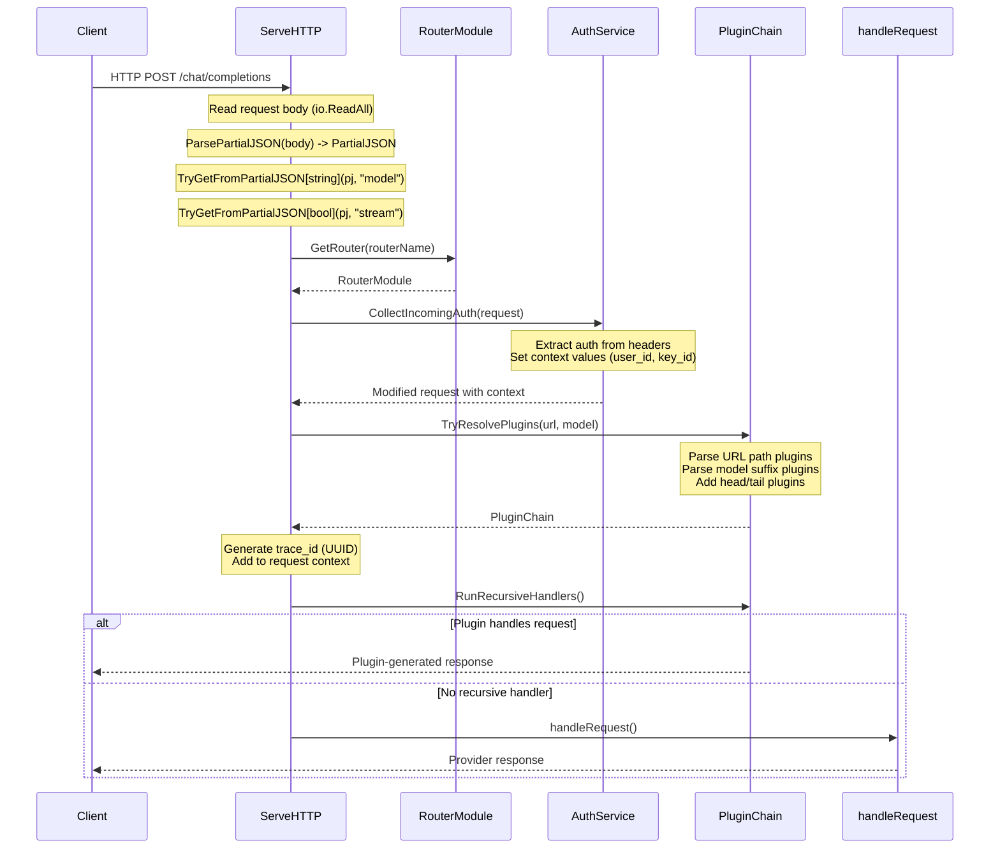

### 2. Request Body Processing (PartialJSON)

The system uses `styles.PartialJSON` (a `map[string]json.RawMessage`) to enable lazy parsing - the body is parsed once at the top level, but nested fields like `messages` are only parsed when actually needed.

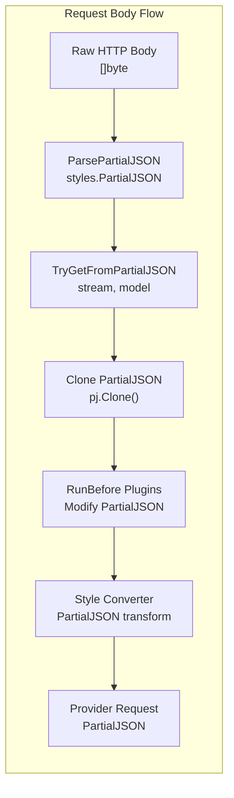

**Key Benefits of PartialJSON:**
- Parse once at entry, avoid repeated `json.Unmarshal` calls
- Access top-level fields (`model`, `stream`) without parsing nested content
- Plugins can modify fields via `pj.Set(key, value)` without full round-trip
- Clone is cheap - just copies map pointers to `json.RawMessage` slices

### 3. Provider Resolution

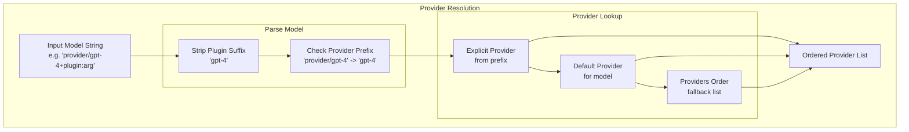

## Non-Streaming Flow

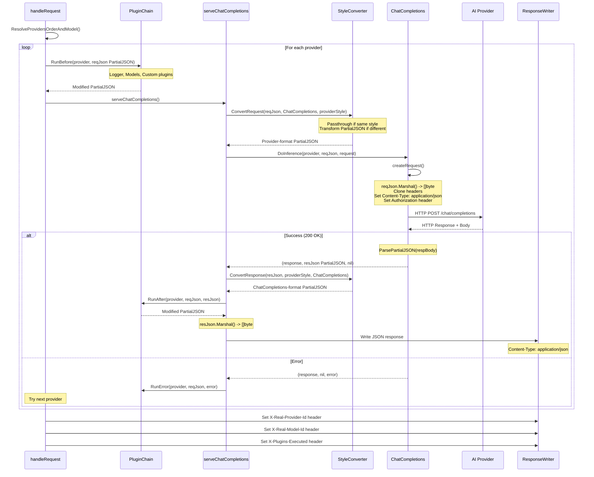

## Streaming Flow

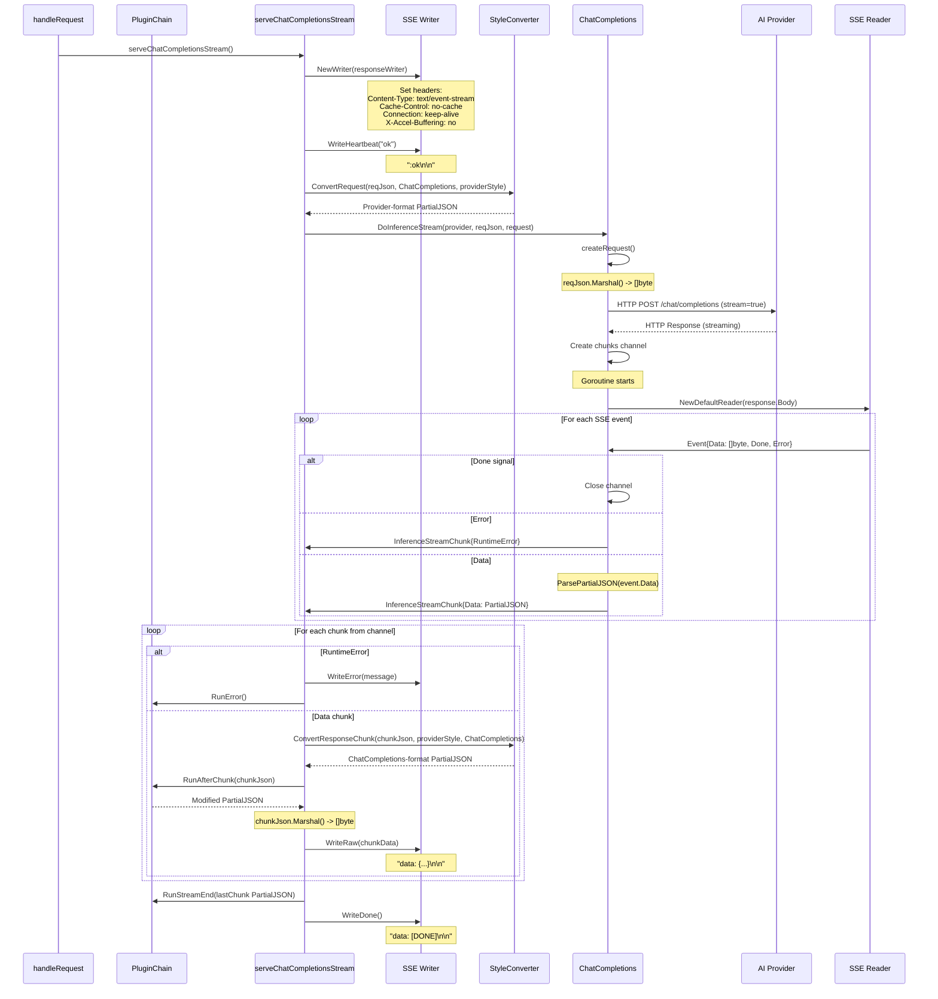

## Header Flow Details

### Incoming Request Headers

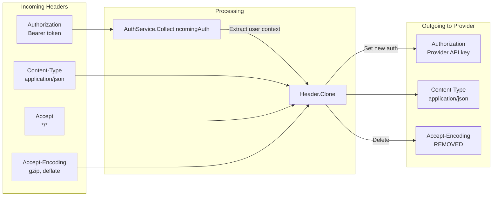

### Response Headers

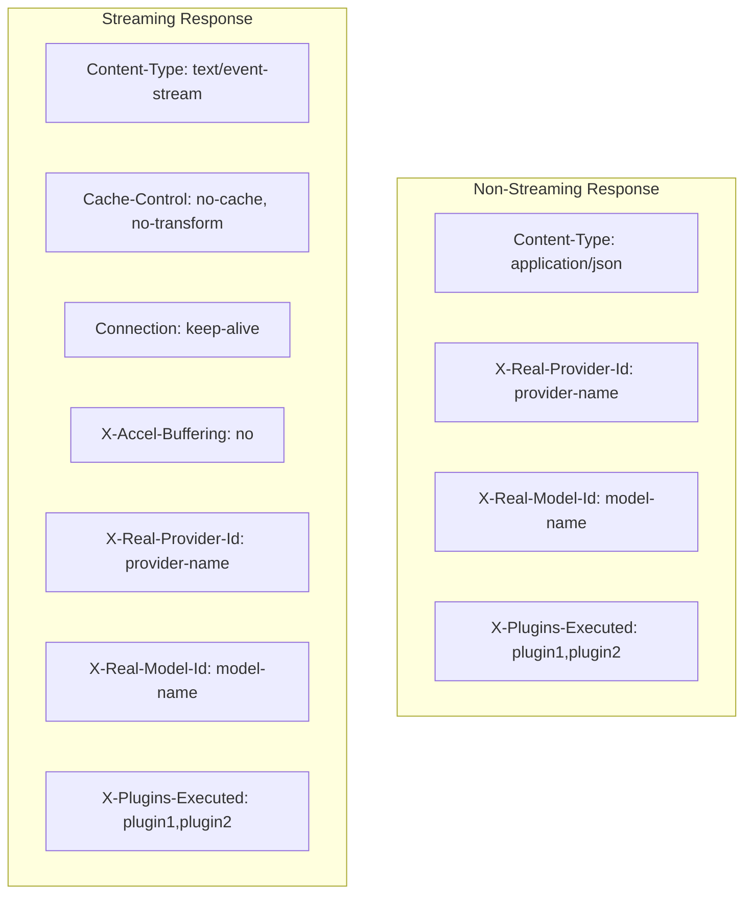

## Plugin Chain Execution Order

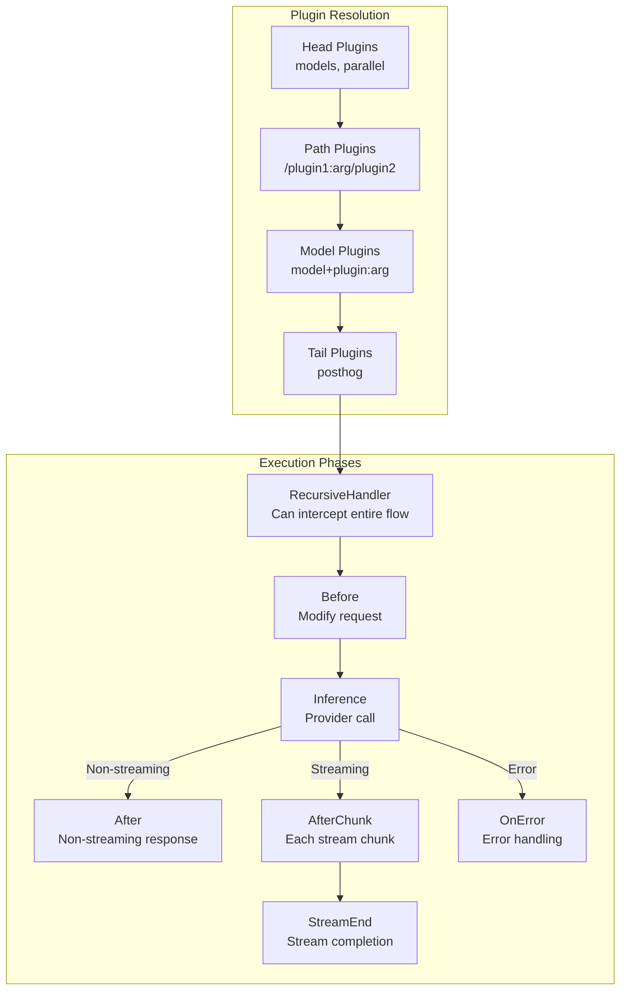

## Style Conversion (with PartialJSON)

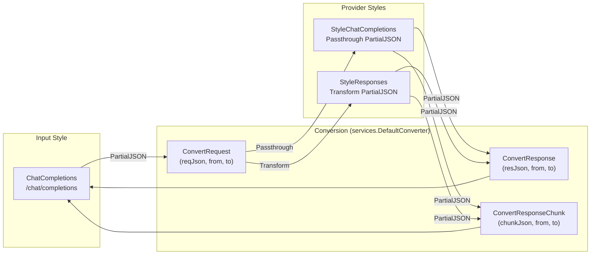

## Context Values

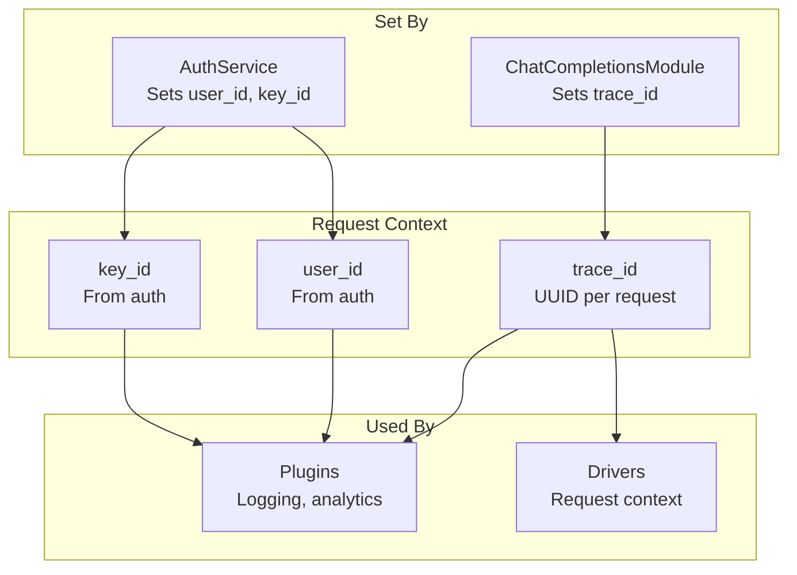

## Error Handling Flow

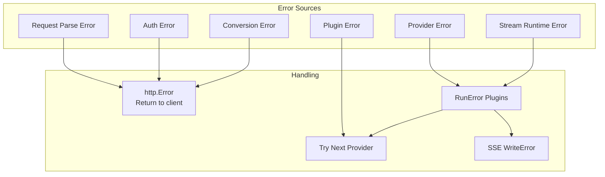

## Data Types Summary

| Stage | Type | Description |
|-------|------|-------------|
| HTTP Request Body | `[]byte` | Raw JSON bytes from client |
| Parsed Request | `styles.PartialJSON` | `map[string]json.RawMessage` - lazy parsed |
| Field Access | `TryGetFromPartialJSON[T]` | Type-safe extraction (e.g., `model`, `stream`) |
| Plugin Processing | `styles.PartialJSON` | Modifiable via `Set()`, clonable via `Clone()` |
| Style Conversion | `styles.PartialJSON` | Transformed between formats |
| Provider Request | `styles.PartialJSON` | Serialized to `[]byte` at driver boundary |
| Provider Response | `styles.PartialJSON` | Parsed from provider response |
| Stream Chunk | `drivers.InferenceStreamChunk` | `{Data: styles.PartialJSON, RuntimeError: error}` |
| SSE Event | `sse.Event` | `{Data: []byte, Done: bool, Error: error}` |
| HTTP Response | `[]byte` / SSE stream | Final client response (serialized from PartialJSON) |

### PartialJSON Type Details

```go
// styles/partial_json.go
type PartialJSON map[string]json.RawMessage

// Core operations
ParsePartialJSON(data []byte) (PartialJSON, error)     // Parse raw bytes
TryGetFromPartialJSON[T](pj, key) T                    // Type-safe field access
pj.Set(key, value) error                               // Modify field
pj.Clone() PartialJSON                                 // Shallow clone
pj.Marshal() ([]byte, error)                           // Serialize back to bytes
```

### Driver Interface (with PartialJSON)

```go
// drivers/interfaces.go
type InferenceCommand interface {
    DoInference(p *ProviderService, reqJson styles.PartialJSON, r *http.Request) (*http.Response, styles.PartialJSON, error)
    DoInferenceStream(p *ProviderService, reqJson styles.PartialJSON, r *http.Request) (*http.Response, chan InferenceStreamChunk, error)
}

type InferenceStreamChunk struct {
    Data         styles.PartialJSON
    RuntimeError error
}
```

### Plugin Interfaces (with PartialJSON)

```go
// plugin/interfaces.go
type BeforePlugin interface {
    Before(params string, p *ProviderService, r *http.Request, reqJson styles.PartialJSON) (styles.PartialJSON, error)
}

type AfterPlugin interface {
    After(params string, p *ProviderService, r *http.Request, reqJson styles.PartialJSON, res *http.Response, resJson styles.PartialJSON) (styles.PartialJSON, error)
}

type StreamChunkPlugin interface {
    AfterChunk(params string, p *ProviderService, r *http.Request, reqJson styles.PartialJSON, res *http.Response, chunk styles.PartialJSON) (styles.PartialJSON, error)
}
```
